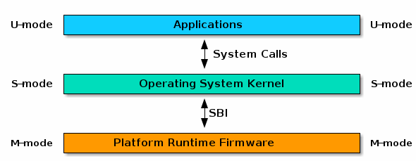

# 实验4: RV64 内核引导

## 1 实验目的
* 学习RISC-V汇编， 编写head.S实现跳转到内核运行的第一个C函数。
* 学习OpenSBI，理解OpenSBI在实验中所起到的作用，并调用OpenSBI提供的接口完成字符的输出。
* 学习Makefile相关知识，补充项目中的Makefile文件，来完成对整个工程的管理。
## 2 实验环境

- Ubuntu 20.04, 22.04

## 3 实验基础知识介绍

### 3.1 RISC-V 架构

实验中涉及的RISC-V相关的知识来自于以下文档：

- [RISC-V Assembly Programmer's Manual](https://github.com/riscv-non-isa/riscv-asm-manual/blob/master/riscv-asm.md)
- [RISC-V Unprivileged Spec](https://github.com/riscv/riscv-isa-manual/releases/download/Ratified-IMAFDQC/riscv-spec-20191213.pdf)
- [RISC-V Privileged Spec](https://github.com/riscv/riscv-isa-manual/releases/download/Priv-v1.12/riscv-privileged-20211203.pdf)

> 注：RISC-V 手册（中文）中有一些Typo，请谨慎参考。

### 3.2 RISC-V 的三种特权模式

RISC-V 有三个特权模式：U (user) 模式、S (supervisor) 模式和 M (machine) 模式。

| Level  | Encoding |       Name       | Abbreviation |
| ------ | -------- |----------------- | ------------ |
|   0    |    00    | User/Application |      U       |
|   1    |    01    |     Supervisor   |      S       |
|   2    |    10    |     Hypervisor   |      H       |
|   3    |    11    |      Machine     |      M       |

其中：

- M模式是对硬件操作的抽象，有**最高**级别的权限
- S模式介于M模式和U模式之间，在操作系统中对应于内核态(Kernel)。当用户需要内核资源时，向内核申请，并切换到内核态进行处理
- U模式用于执行用户程序，在操作系统中对应于用户态，有**最低**级别的权限

### 3.3 从计算机上电到 OS 运行

我们以最基础的嵌入式系统为例，计算机上电后，首先硬件进行一些基础的初始化后，将CPU的Program Counter移动到内存中Bootloader的起始地址。
Bootloader是操作系统内核运行之前，用于初始化硬件，加载操作系统内核。
在RISC-V架构里，Bootloader运行在M模式下。Bootloader运行完毕后就会把当前模式切换到S模式下，机器随后开始运行Kernel。

这个过程简单而言就是这样：

```
   Hardware             RISC-V M Mode           RISC-V S Mode 
+------------+         +--------------+         +----------+
|   BootROM  |  ---->  |  Bootloader  |  ---->  |  Kernel  |
+------------+         +--------------+         +----------+
```

### 3.4 SBI 与 OpenSBI

SBI(Supervisor Binary Interface)是S-mode的Kernel和M-mode执行环境之间的接口规范，而[OpenSBI](https://github.com/riscv-software-src/opensbi)是一个RISC-V SBI规范的开源实现。
RISC-V平台和SoC供应商可以自主扩展OpenSBI实现，以适应特定的硬件配置。

简单的说，为了使操作系统内核适配不同硬件，OpenSBI提出了一系列规范对M-mode下的硬件进行了统一定义，运行在S-mode下的内核可以按照这些规范对不同硬件进行操作。



在启动qemu时，我们指定的BIOS就是编译过后的OpenSBI，它作为Bootloader会完成M-mode下的硬件初始化与寄存器设置，并使用M模式下基本系统调用服务，例如字符打印。

在实验中，virt配置的QEMU会将OpenSBI代码加载到0x80000000起始处，OpenSBI初始化完成后，会跳转到0x80200000处继续执行。因此，我们所编写的代码需要放到0x80200000处。

如果你对在RISC-V架构上从零构造并启动真实的Linux系统有更多的好奇，可以参考ZJV团队开发的RISC-V模拟器开发环境套件[riscv-rss-sdk](https://github.com/riscv-zju/riscv-rss-sdk)。

### 3.5 Makefile

Makefile 可以简单的认为是一个工程文件的编译规则，描述了整个工程的编译和链接流程。在Lab3中我们已经使用了make工具利用Makefile文件来管理整个工程。
在阅读了[Makefile介绍](https://seisman.github.io/how-to-write-makefile/introduction.html)章节后，同学们可以根据工程文件夹里Makefile的代码来掌握一些基本的使用技巧。

### 3.6 内联汇编
内联汇编（通常由asm或者\_\_asm\_\_关键字引入）提供了将汇编语言源代码嵌入C程序的能力。
内联汇编的详细介绍请参考[Assembler Instructions with C Expression Operands](https://gcc.gnu.org/onlinedocs/gcc/Extended-Asm.html)。
下面简要介绍一下这次实验会用到的一些内联汇编知识：

内联汇编基本格式为：

```c
    __asm__ volatile (
        "instruction1\n"
        "instruction2\n"
        ......
        ......
        "instruction3\n"
        : [out1] "=r" (v1),[out2] "=r" (v2)
        : [in1] "r" (v1), [in2] "r" (v2)
        : "memory"
    );
```

其中，三个`:`将汇编部分分成了四部分：

- 第一部分是汇编指令，指令末尾需要添加'\n'。
- 第二部分是输出操作数部分。
- 第三部分是输入操作数部分。
- 第四部分是可能影响的寄存器或存储器，用于告知编译器当前内联汇编语句可能会对某些寄存器或内存进行修改，使得编译器在优化时将其因素考虑进去。

这四部分中后三部分不是必须的。

#### 示例一

```c
unsigned long long s_example(unsigned long long type,unsigned long long arg0) {
    unsigned long long ret_val;
    __asm__ volatile (
        "mv x10, %[type]\n"
        "mv x11, %[arg0]\n"
        "mv %[ret_val], x12"
        : [ret_val] "=r" (ret_val)
        : [type] "r" (type), [arg0] "r" (arg0)
        : "memory"
    );
    return ret_val;
}
```
示例一中指令部分，`%[type]`、`%[arg0]`以及`%[ret_val]`代表着特定的寄存器或是内存。

输入输出部分中，`[type] "r" (type)`代表着将`()`中的变量`type`放入寄存器中（`"r"`指放入寄存器，如果是`"m"`则为放入内存），并且绑定到`[]`中命名的符号中去。`[ret_val] "=r" (ret_val)`代表着将汇编指令中`%[ret_val]`的值更新到变量`ret_val`中。

#### 示例二

```c
#define write_csr(reg, val) ({
    __asm__ volatile ("csrw " #reg ", %0" :: "r"(val)); })
```

示例二定义了一个宏，其中`%0`代表着输出输入部分的第一个符号，即`val`。

`#reg`是c语言的一个特殊宏定义语法，相当于将reg进行宏替换并用双引号包裹起来。

例如`write_csr(sstatus,val)`经宏展开会得到：

```c
({
    __asm__ volatile ("csrw " "sstatus" ", %0" :: "r"(val)); })
```

### 3.7 编译相关知识介绍
#### vmlinux.lds

GNU ld即链接器，用于将`*.o`文件（和库文件）链接成可执行文件。
在操作系统开发中，为了指定程序的内存布局，ld使用链接脚本（Linker Script）来控制，在Linux Kernel中链接脚本被命名为vmlinux.lds。
更多关于ld的介绍可以使用`man ld`命令。

下面给出一个 vmlinux.lds 的例子：

```lds
OUTPUT_ARCH( "riscv" )

/* 程序入口 */
ENTRY( _start )

/* kernel代码起始位置 */
BASE_ADDR = 0x80200000;

SECTIONS
{
    /* . 代表当前地址 */
    . = BASE_ADDR;

    /* 记录kernel代码的起始地址 */
    _start = .;

    /* ALIGN(0x1000) 表示4KB对齐 */
    /* _stext, _etext 分别记录了text段的起始与结束地址 */
    .text : ALIGN(0x1000){
        _stext = .;

        *(.text.entry)
        *(.text .text.*)
        
        _etext = .;
    }

    .rodata : ALIGN(0x1000){
        _srodata = .;

        *(.rodata .rodata.*)
        
        _erodata = .;
    }

    .data : ALIGN(0x1000){
        _sdata = .;

        *(.data .data.*)
        
        _edata = .;
    }

    .bss : ALIGN(0x1000){
        _sbss = .;

        *(.sbss .sbss.*)
        *(.bss .bss.*)
        
        _ebss = .;
    }

    /* 记录kernel代码的结束地址 */
    . = ALIGN(0x1000);
    _end = .;
}
```

首先我们使用OUTPUT_ARCH指定了架构为RISC-V，之后使用ENTRY指定程序入口点为`_start`函数，程序入口点即程序启动时运行的函数，经过这样的指定后在head.S中需要编写`_start`函数，程序才能正常运行。

链接脚本中有`.`、`*`两个重要的符号。单独的`.`在链接脚本代表当前地址，它有赋值、被赋值、自增等操作。而`*`有两种用法，其一是`*()`在大括号中表示将所有文件中符合括号内要求的段放置在当前位置，其二是作为通配符。

链接脚本的主体是SECTIONS部分，在这里链接脚本的工作是将程序的各个段按顺序放在各个地址上，在例子中就是从0x80200000地址开始放置了`.text`，`.rodata`，`.data`和`.bss`段。各个段的作用可以简要概括成：

| 段名     | 主要作用                       |
| ------- | ----------------------------- |
| .text   | 通常存放程序执行代码              |
| .rodata | 通常存放常量等只读数据            |
| .data   | 通常存放已初始化的全局变量、静态变量 |
| .bss    | 通常存放未初始化的全局变量、静态变量 |

在链接脚本中可以自定义符号，例如以上所有`_s`与 `_e`开头的符号都是我们自己定义的。

更多有关链接脚本语法可以参考[这里](https://sourceware.org/binutils/docs/ld/Scripts.html)。

#### vmlinux

vmlinux通常指Linux Kernel编译出的可执行文件(Executable and Linkable Format / ELF)，特点是未压缩的，带调试信息和符号表的。
在整套实验中，vmlinux通常指将你的代码进行编译，链接后生成的可供QEMU运行的RV64架构程序。如果对vmlinux使用`file`命令，你将看到如下信息：

```bash
$ file vmlinux 
vmlinux: ELF 64-bit LSB executable, UCB RISC-V, version 1 (SYSV), statically linked, not stripped
```

#### System.map

System.map是内核符号表（Kernel Symbol Table）文件，是存储了所有内核符号及其地址的一个列表。“符号”通常指的是函数名，全局变量名等等。使用`nm vmlinux`命令即可打印vmlinux的符号表，符号表的样例如下：

```
0000000000000800 A __vdso_rt_sigreturn
ffffffe000000000 T __init_begin
ffffffe000000000 T _sinittext
ffffffe000000000 T _start
ffffffe000000040 T _start_kernel
ffffffe000000076 t clear_bss
ffffffe000000080 t clear_bss_done
ffffffe0000000c0 t relocate
ffffffe00000017c t set_reset_devices
ffffffe000000190 t debug_kernel
```

使用 System.map 可以方便地读出函数或变量的地址，为 Debug 提供了方便。

## 4 实验步骤

### 4.1 准备工程
【重要】 使用 `git`命令从 [上游仓库](https://git.zju.edu.cn/zju-sys/sys2lab-22fall-stu) 同步实验代码框架。

```
├── arch
│   └── riscv
│       ├── include
│       │   ├── defs.h
│       │   └── sbi.h
│       ├── kernel
│       │   ├── head.S
│       │   ├── Makefile
│       │   ├── sbi.c
│       │   └── vmlinux.lds
│       └── Makefile
├── include
│   ├── print.h
│   └── types.h
├── init
│   ├── main.c
│   ├── Makefile
│   └── test.c
├── lib
│   ├── Makefile
│   └── print.c
└── Makefile
```

本次实验中，同学们需要完善以下文件，实验源代码里添加了错误提示，完成代码后记得将相关的提示清除：

- arch/riscv/kernel/head.S
- lib/Makefile
- arch/riscv/kernel/sbi.c
- lib/print.c
- arch/riscv/include/defs.h

### 4.2 编写head.S

学习riscv的汇编，完成arch/riscv/kernel/head.S。
我们首先为即将运行的第一个C函数设置程序栈（栈的大小可以设置为4KB），并将该栈放置在程序的后面，也就是`_end`以后的地址空间。
```
_start────►┌──────────┐
           │   text   │
           ├──────────┤
           │  rodata  │
           ├──────────┤
           │   data   │
           ├──────────┤
           │   bss    │
 _end─────►├──────────┤
           │4KB stack │
  sp──────►└──────────┘
```
设置好C执行环境后，接下来我们只需要通过跳转指令，跳转至 main.c 中的`start_kernel`函数即可。

### 4.3 完善 Makefile 脚本

阅读文档中关于[Makefile](#35-makefile)的章节，以及工程文件中的Makefile文件。
根据注释学会Makefile的使用规则后，清除掉`lib/Makefile`中的error函数并完成正确的构造规则，使工程得以编译。  
完成此步后在工程根文件夹执行make，可以看到不会再提示Makefile的错误，而是C的未完成的代码块的提示。

### 4.4 补充 `sbi.c`

OpenSBI在M态，为S态提供了多种接口，比如字符串输入输出。
因此我们需要实现调用 OpenSBI 接口的功能。给出函数定义如下：
```c
struct sbiret {
	long error;
	long value;
};

struct sbiret sbi_ecall(int ext, int fid, 
                    uint64 arg0, uint64 arg1, uint64 arg2,
                    uint64 arg3, uint64 arg4, uint64 arg5);
```

`sbi_ecall` 函数中，需要完成以下内容：

1. 将ext(Extension ID)放入寄存器a7中，fid(Function ID)放入寄存器a6中，将arg[0-5]放入寄存器a[0-5]中。
2. 使用`ecall`指令。`ecall`之后系统会进入M模式，之后OpenSBI会完成相关操作。
3. OpenSBI的返回结果会存放在寄存器a0、a1中，其中a0为error code，a1为返回值，我们用sbiret结构来接受这两个返回值。

同学们可以参照内联汇编的示例一完成该函数的编写。
编写成功后，调用`sbi_ecall(0x1, 0x0， 0x30, 0, 0, 0, 0, 0)`将会输出字符'0'。
其中`0x1`代表`sbi_console_putchar`的ExtensionID，`0x0`代表FunctionID, 0x30代表'0'的ascii值，其余参数填0。

请在`arch/riscv/kernel/sbi.c`中补充`sbi_ecall()`。

下面列出了一些在后续的实验中可能需要使用的功能。

|Function Name | Function ID | Extension ID |
|---|---|---|
|sbi_set_timer （设置时钟相关寄存器） |0|0x00| 
|sbi_console_putchar （打印字符）|0|0x01| 
|sbi_console_getchar （接收字符）|0|0x02| 


### 4.5 `puts()` 和 `puti()`
调用以上完成的`sbi_ecall`, 完成`puts()`和`puti()`的实现。
`puts()`用于打印字符串`puti()`用于打印整型变量。

请编写`lib/print.c`中的`puts()`和`puti()`，函数的相关定义已经写在了`print.h`文件。

### 4.6 修改 defs

学习了解了内联汇编的相关知识后，补充`arch/riscv/include/defs.h`中的代码，完成`read_csr`宏定义。
完成完以上内容后再次执行make，可以看到在根目录下成功生成了vmlinux。
运行make run即可执行，检测你的程序是否正确地打印出了欢迎信息`2022  ZJU Computer System II`。


## 思考题

1. 编译之后，通过System.map查看vmlinux.lds中自定义符号的值，比较他们的地址是否符合你的预期
2. 在你的第一条指令处添加断点，观察你的程序开始执行时的特权态是多少，中断的开启情况是怎么样的？
**提示**：可以在gdb中使用`info reg priv`指令查看特权态
3. 在你的第一条指令处添加断点，观察内存中text、data、bss段的内容是怎样的？
4. 尝试从汇编代码中给C函数start_kernel传递参数

## 作业提交
同学需要提交实验报告以及整个工程代码，提交时请注意如下几点：

1. 报告的pdf放在外面，压缩包只放代码。
    ```
    提交文件
    ├── report.pdf
    └── code.zip
    ```
2. 提交前请使用 `make clean` 清除所有构建产物。
